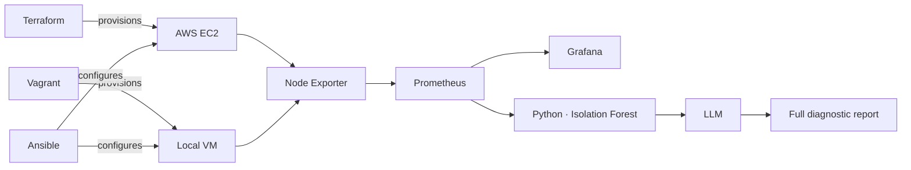
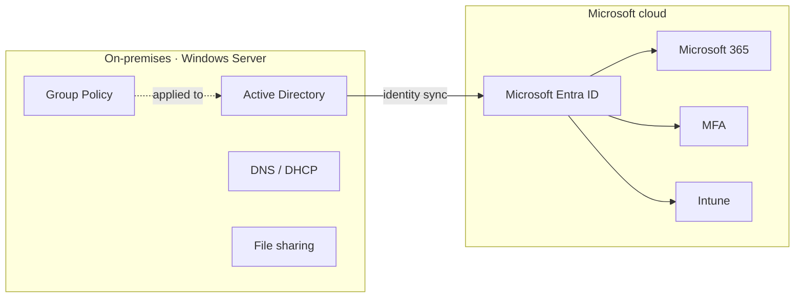

```console
leila@inpt:~$ terraform plan
```

```hcl
resource "engineer" "leila_gadal" {
  school   = "INPT, Rabat — Smart ICT (Cloud & Infrastructure)"
  year     = final-year
  origin   = "Morocco"


  looking_for = "final-year engineering internship (PFE)"
}
```

---

## 🎓 Smart ICT (Cloud & Infrastructure) Engineering student at INPT (Rabat, Morocco)

* ☁️ Passionate about **Cloud Computing, Infrastructure Engineering and AIOps**
* 🛠️ Strong interest in **Infrastructure as Code, automation, containerization and monitoring**
* 📦 Hands-on with **Terraform, Ansible, Docker, AWS, Prometheus/Grafana and Active Directory**
* 🔐 Interested in **Cloud Security, Identity & Access Management and hybrid architectures**
* 🤖 Applying **ML and LLMs** to infrastructure: anomaly detection and automated diagnostics
* 🤝 Open to **final-year internships (PFE)**, infrastructure projects and cloud-native collaborations

---

## 🧰 Tech Stack

### 🧑‍💻 Programming & Scripting

<p>

</p>

`Python` · `Bash` · `HTML/CSS`

### ⚙️ Backend / Apps

<p>

</p>

`Flask` · `REST APIs`

### ☁️ Cloud Platforms

<p>

</p>

`AWS (EC2)` · `Microsoft Entra ID` · `Microsoft 365` · `Hybrid Infrastructure`

### 🚀 DevOps & Containers

<p>

</p>

`Docker` · `Kubernetes (concepts)` · `Git` · `GitHub` · `Scrum` · `Jira`

### 🏗️ Infrastructure as Code & Automation

<p>

</p>

`Terraform` · `Ansible` · `Vagrant` · `Bash` · `Infrastructure as Code`

### 🖥️ Systems & Networking

<p>

</p>

`Linux` · `Windows Server` · `Active Directory` · `GPO` · `DNS/DHCP` · `TCP/IP` · `VLAN` · `Routing` · `Network Diagnostics` · `Cisco`

### 📊 Monitoring & AIOps

<p>

</p>

`Prometheus` · `Grafana` · `Node Exporter` · `Pandas` · `Scikit-learn` · `Isolation Forest` · `XGBoost` · `Anomaly Detection` · `LLM-based Diagnostics`

### 🔐 Security & Identity

`MFA` · `Privileged Access Control` · `Identity Governance` · `Intune` · `CIS Benchmarks` · `IT Security Auditing` · `Network Intrusion Detection` · `DoS/DDoS Detection`

---

## 🧩 Featured modules

### ☁️ `aiops-hybrid-cloud`: from metrics to diagnosis

A hybrid infrastructure (local VM + AWS EC2) provisioned as code, monitored continuously, and analysed by ML and an LLM that produces a full diagnostic report.



**Stack:** Terraform · Vagrant · Ansible · AWS · Prometheus · Grafana · Node Exporter · Python · Scikit-learn · LLM
[→ Repository](https://github.com/leila-gad/AIOps-Hybrid-Cloud-Infrastructure)

### 🖥️ `microsoft-infra-lab`: hybrid identity, end to end

An enterprise-style Microsoft environment: on-premises Active Directory extended to the cloud, with identity and security controls evaluated against Microsoft and CIS best practices.



* Designed and deployed the AD environment: GPOs, DNS, DHCP and file services
* Implemented a hybrid identity setup with Entra ID and Microsoft 365
* Enforced multi-factor authentication and controlled administrative privileges
* Audited security controls against Microsoft and CIS best practices, with structured recommendations

### 🛡️ `netguard`: real-time intrusion detection

An XGBoost model detecting DoS/DDoS traffic, served through a Flask REST API, containerized with Docker, with real-time visualization of detected threats.
[→ Repository](https://github.com/leila-gad/NETGUARD-for-DOS-DDOS)

### 🔄 `camunda7-to-kogito`: cloud-native migration study

Migration analysis of BPMN workflows from Camunda 7 to Kogito (Quarkus/Kubernetes): process compatibility, REST integration, Scrum delivery with a Jira backlog.
[→ Repository](https://github.com/leila-gad/PoC-cammunda7-vers-kogito)

---

## 🗂️ Experience

```text
2026-07 → 2026-09  Ministry of Digital Transition   IT systems audit & governance
2026-02 → 2026-05  Orange Business Morocco          cloud-native platform transformation
2025-summer        OCP Group                        network diagnostics & access security
```

---

## 🏆 Certifications

<p>


</p>

## 📊 GitHub Statistics

<div align="center">


</div>

## 📈 Contribution Activity

<div align="center">


</div>

---

```text
Plan: 1 to add, 0 to change, 0 to destroy.

Do you want to perform these actions?
  Only 'yes' will be accepted to approve.

  Enter a value:
```

**yes** → [leilagadal653@gmail.com](mailto:leilagadal653@gmail.com) · [LinkedIn](https://www.linkedin.com/in/leila-gadal-64745632b)
